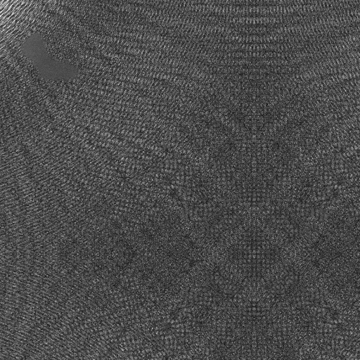
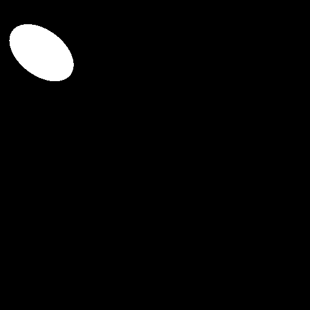

# 🧵 Surface Defect Detection Demo — Textile Production

This repository contains a **supervised deep-learning demo** for pixel-level defect segmentation in industrial textile images.  
A U-Net model, trained on manually labeled data, predicts surface anomalies. The demo includes a Flask web app where you can upload an image and instantly view the predicted defect mask side-by-side with the original.

---

## 🎯 Demo Highlights

| Feature           | Details                                                                      |
|-------------------|------------------------------------------------------------------------------|
| **Architecture**  | U-Net (encoder–decoder with skip connections)                                |
| **Learning type** | Supervised segmentation — model trained on expert-annotated masks            |
| **Use case**      | Inline quality control / surface-defect detection in textile production      |
| **Web UI**        | Modern upload page, responsive layout, original & mask displayed together    |

---

> **Sample data**  
> Ready-made test images reside in **`Test/`** (masks in `Test/Label/`).  
> Upload any file from this folder through the web interface to see the model in action.

---

## 🚀 Quick Start

```bash

#  install requirements
pip install -r requirements.txt

#  run the web demo
python3 src/demo/backend.py
````

Open **[http://127.0.0.1:5000](http://127.0.0.1:5000)** and either upload your own 256 × 256 grayscale textile image **or pick one from the `Test/` folder**.

| Original               | Predicted Mask                     |
| ---------------------- | ---------------------------------- |
|  |  |

## Example Output

---

## 🧠 Model Training Summary

1. **Dataset**   DAGM 2007 (Class 1) resized to 256 × 256 grayscale
2. **Labels**    Binary defect masks (1 = defect, 0 = background)
3. **Training**  U-Net, 50 epochs, Adam (lr 1e-4), BCELoss
4. **Validation** 80 / 20 split; best weights saved as `unet_dagm_class1.pth`

> **Note:** This is supervised ML — the network learns strictly from labeled examples.

---

## ⚙️ Adapting to Your Production Line

* **Different materials?** Fine-tune with your own labeled dataset.
* **Other defect types?** Retrain with additional mask channels.
* **Edge deployment?** Containerized builds available for on-prem devices.

For professional integration or custom training, contact us at **[info@sagel-ai.com](mailto:info@sagel-ai.com)**

---
